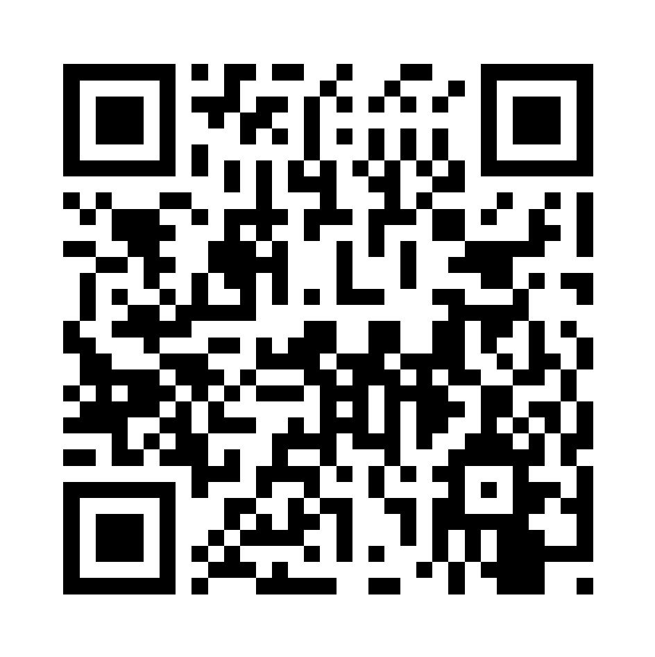

# imaging-demo-kit

This is a demo kit for the CZI Imaging Tech Team. The demo kit
contains scripts and environment files to prepare for demos.

The tools installed by this library are currently focused on
`Python`-based tools, but primarily `napari`
and `napari` plugins.

## How to use this for giving demos

You have already installed:

- mambaforge

Steps:

1. Clone the repo
2. Run the pre-setup scripts (this may take time and disk space): `scripts/presenter_setup.sh`

